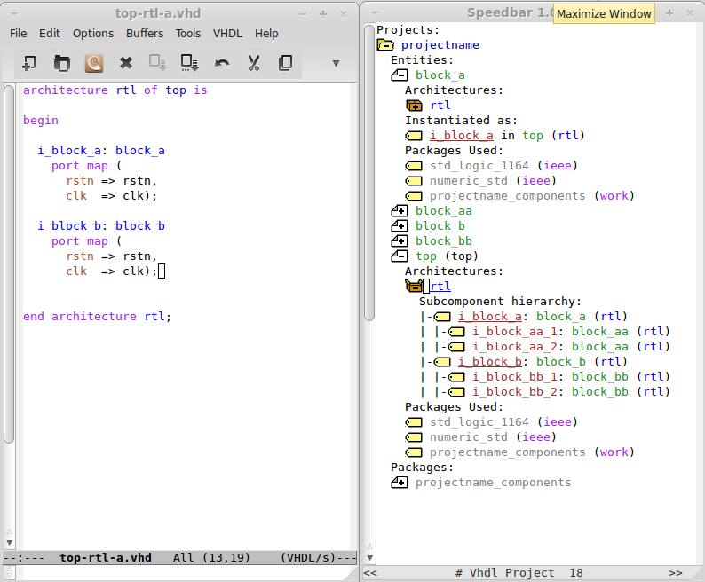

Emacs VHDL project example
==========================

Show case incremental compile with Questasim and the excellent emacs vhdl mode hierachy sidebar.


Configure
---------
```
#do
source sourceme.csh
#or if you are lucky enough to use bash
source sourceme.bash
```

Compile and generate the components package
-------------------------------------------
```
make
```

View hierachy in the sidebar 
----------------------------
```
emacs -q -l emacs_vhdl_project_config_gui.el rtl/top-e.vhd 
```




Touch one file and see the incremental compile
----------------------------------------------
```
touch rtl/block_bb-rtl-a.vhd
make
```

Generate the configurations
---------------------------
```
make conf
```
